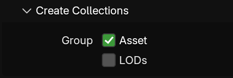
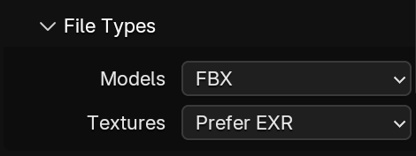
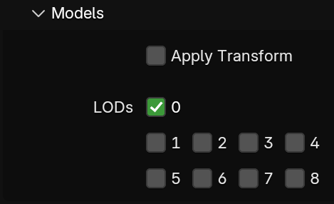
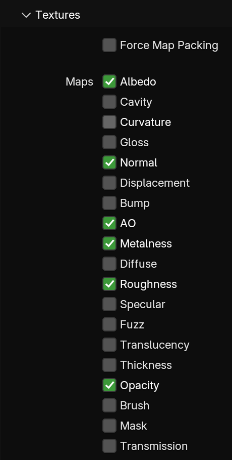

# BetterMegascan


Simple addon to help you import Quixel Megascans into your Blender scenes.
No more need for clunky Bridge to be installed.

## Features
Allows import of:
  - 3D Assets (plants)
  - Surfaces (decals, atlases, etc.)
  - Brushes (albedo with opacity maps)
  - Naming templates

## Usage
For the best interoperability please use the legacy Megascans or legacy Bridge for downloading assets.
- Megascans: https://quixel.com/megascans/
- Bridge (download): https://quixel.com/account

Import menu can be found under `File > Import > Megascan`.
This add-on is designed to work with both extracted and zipped assets.

### Importing Models
The import process is highly customizable.

#### Asset
**WIP**
- Mark
- Tags
  - tag types


#### Create Collections
You can group the whole asset and by LODs.




#### File Types
Choose which file types will be used.




#### Models
LODs can be individually selected. LOD 0 is the default full model form.

Some models import with transformation applied, you can apply them after import.



#### Textures
Choose which maps to import.
Material will be automatically created based on selected maps.
When importing from zip the maps will be automatically packed, however you can force map packing upon import.



### Importing Surfaces
Materials can be imported from almost any asset (including 3D assets). The process is very similar to model import.

### Importing Brushes
Automatically creates a brush from any kind of asset.
A more complex texture nodes setup is created when opacity and albedo are found.

## Preferences
All created names are templated. Every field tells its available variable names.
Using the Python template form is simple:
```
simply:
"hello $name" => "hello <name goes here>"

to be safe:
"hello ${name}" => "hello <name goes here>"
```

Default import menu type is pie. If you want a default menu there is an option for that.

## Installation
- Get your own copy in [Releases](https://github.com/Zexyp/BetterMegascan/releases)
- `Edit > Preferences > Add-ons > Get Extensions > Extension Settings > Install from Disk...`\
  (Extension Settings are the little down arrow in the top right corner)
  > [!NOTE]
  > *Please don't use this repository as the zip file
  > (if you are inclined to do so, just use the directory with sources)*
- Activate if necessary

## References
- https://gist.github.com/kamilwaheed/b324ed9637c7a6599650 (outdated)
- https://quixel.github.io/megascans-api-docs/quick-start-guide/ (also outdated)

